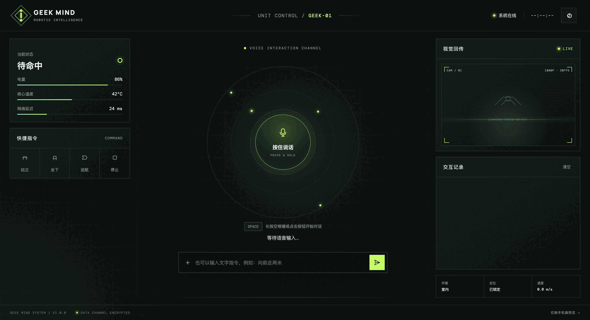
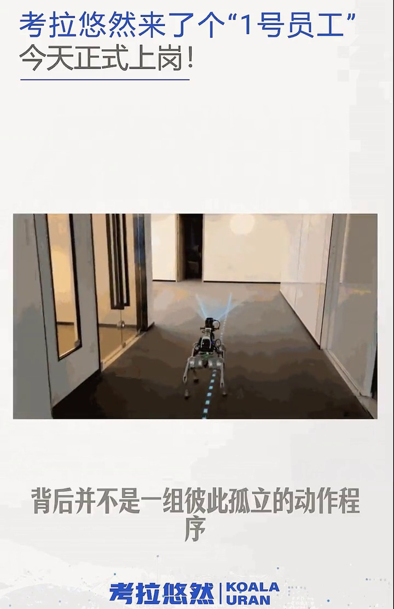
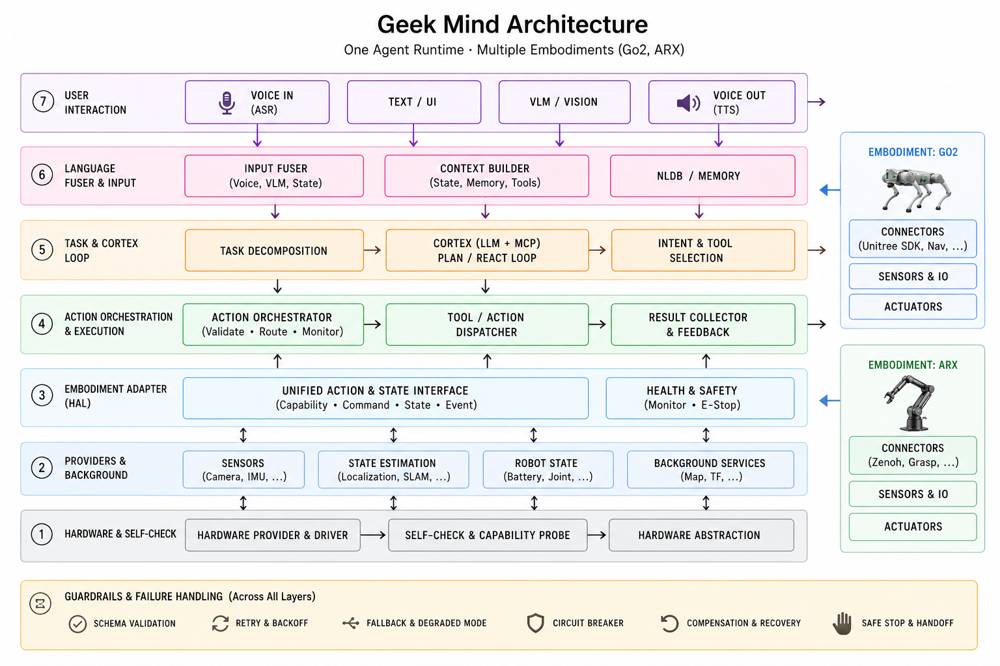

<div align="center">

# Geek Mind

**Universal Embodiment Agent Runtime**

One Agent Runtime · Multiple Embodiments · Perception-to-Action Closed Loop

</div>

Geek Mind is an embodied-agent runtime for connecting multimodal interaction, task planning, tool use, and physical execution across heterogeneous robots. A shared Cortex loop turns voice, text, vision, and robot state into semantic actions, while embodiment adapters route those actions to platforms such as Unitree Go2 and ARX X5 and feed verified execution results back into the next planning cycle.

## Frontend

<p align="center">
  
</p>

## Project Demo

<p align="center">
  <a href="docs/assets/geek-mind-demo.mp4">
    
  </a>
  <br>
  <a href="docs/assets/geek-mind-demo.mp4"><strong>▶ Play the project demo (MP4)</strong></a>
</p>

## Architecture



The runtime is organized as a layered closed loop: hardware and self-check, providers and background services, a unified embodiment interface, action orchestration, Cortex planning, language-aligned context, and user interaction. Go2 and ARX keep their own sensors, connectors, and actuators while sharing the same high-level task and feedback path.

## Capabilities

- **Multimodal interaction** — voice, text/UI, VLM/vision, and speech output.
- **Language-aligned context** — input fusion across live observations, robot state, memory, and available tools.
- **Task and Cortex loop** — task decomposition, LLM/MCP planning, tool selection, and state-driven progression.
- **Action orchestration** — validate, route, dispatch, monitor, and collect physical action results.
- **Multi-embodiment integration** — configuration-driven providers and connectors for Go2 mobility/navigation and ARX X5 manipulation.
- **Runtime safeguards** — configuration validation, hardware preflight, input-freshness gates, bounded tool/action execution, result verification, and cancellation.

## Deployment Profiles

| Profile | Main capabilities |
| --- | --- |
| Unitree Go2 | Voice interaction, robot state, D435 vision, native or Mid360 navigation |
| ARX X5 | RGB-D perception, grasp planning, arm/gripper execution, status feedback |
| Go2 + ARX X5 | Mobile manipulation with coordinated navigation, grasping, and delivery tasks |

Deployment is hardware-specific. See [Ubuntu 22.04 + ROS 2 Humble deployment](HUMBLE_SETUP.md) for the Go2 + Mid360 stack, or [Go2 + ARX startup](STARTUP.md) for the combined robot workflow. Real-robot operation must be supervised with a working emergency stop and a clear operating area.

## Repository Layout

```text
config/          Agent, model, sensor, action, and deployment configurations
scripts/         Environment setup and stack lifecycle commands
service/         Voice, navigation, perception, and hardware service bundles
system_hw_test/  Hardware and transport diagnostics
tests/           Configuration, integration, and deployment checks
tools/           Validation and environment verification utilities
docs/assets/     Architecture and project media
```

## Media Coverage

- [微信公众号｜Geek Mind 项目报道](https://mp.weixin.qq.com/s/_3Vhwg3F90XdgVEWZ5oUNA)
- [中国日报网｜考拉悠然携 Geek Mind 亮相 APEC 数字周：以世界模型推动具身智能走向真实世界](https://cn.chinadaily.com.cn/a/202608/04/WS6a718c1aa310d709c2fc1665.html)
